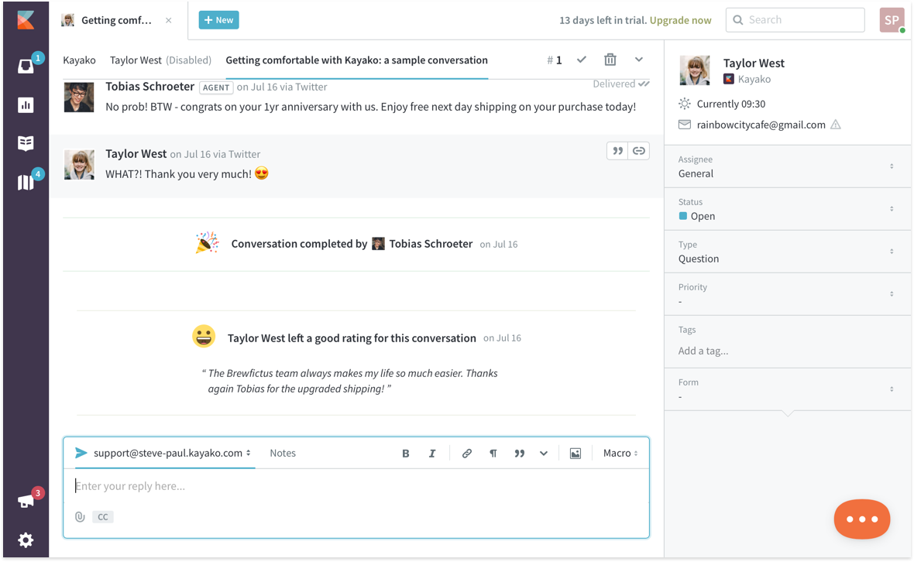

# Frontend-cp



## Prerequisites

1. Please follow the official [Ember getting started guide](https://guides.emberjs.com/current/getting-started/).
2. Fork frontend-cp to your own GitHub account
3. Edit /etc/hosts (you’ll need sudo to do this) and add:
   ```
   127.0.0.1 brewfictus.kayako.com
   ::1       brewfictus.kayako.com
   ```

## Installation

* `git clone git@github.com:you/frontend-cp` this repository
* change into the new directory
* `yarn install`
* `bower install`

## Running / Development

Running a development server with the fake Mirage-powered API:

```
$ ember s
```

Running a development against a real instance of the API:

```
$ ember s --proxy https://some-instance.kayako.com --transp false
```

With both methods of booting the development server, access the app by
visiting [https://brewfictus.kayako.com:4200](https://brewfictus.kayako.com:4200).

### SSL in Development

The ember server uses a self-signed certificate, which is what allows us to
access the dev server over HTTPS. You will need to add an exemption for this
certificate. The method of adding an exemption depends upon your browser of
choice. This is left as an exercise to the reader.

Tip: If you use aladdin you can use the self signed certificate you generated earlier.

### KRE in Development

When proxying to an instance (staging, or local) you must configure
the app to talk to the appropriate KRE instance. Search config/environment.js
for the phrase “Choose a KRE to connect to in development” and un-comment the
desired setting.

## Generating New Code.

Please do use generators, they bake in good idioms and best practises. To see
all the available blueprints, run:

```
$ ember help generate
```

## Running Tests.

There are 2 ways to run the test suite:

* Visit `https://brewfictus.kayako.com:4200/tests`
* Run `ember test` or `ember test --server`

Feel free to use either approach, both are fine.

* To run a specific test visit `https://brewfictus.kayako.com:4200/tests?filter=name of the test` e.g. `https://brewfictus.kayako.com:4200/tests?filter=Acceptance%20|%20admin/team-settings/businesshours%20Edit`

To learn more about ember testing, please see the [official guide](https://guides.emberjs.com/current/testing/).
